# Diagrama EER — Base de datos (Mermaid)

> Diagrama entidad‑relación derivado de [analisis-diseno.md §2](analisis-diseno.md). Pega el bloque
> ```mermaid``` en cualquier visor compatible (mermaid.live, VS Code con la extensión *Markdown
> Preview Mermaid*, GitHub, Obsidian) para renderizarlo.
>
> Leyenda de cardinalidad (notación *crow's foot*):
> `||` = uno y solo uno · `o|` = cero o uno · `o{` = cero o muchos · `|{` = uno o muchos.
> Llaves: **PK** primaria · **FK** foránea · **UK** única. La relación `TARIFAS .. DIAS_PERIODO`
> es punteada porque el precio se **copia** (`precio_aplicado`), no se referencia por FK viva.

```mermaid
erDiagram
    DEPARTAMENTOS {
        bigint id PK
        varchar nombre UK "activo"
        boolean activo "baja logica"
    }

    PERSONAS {
        bigint id PK
        varchar numero_empleado UK "inmutable, nunca reasignado"
        varchar nombre
        bigint departamento_id FK
        varchar foto_path "opcional"
        enum estado "ACTIVO | INACTIVO"
    }

    USERS {
        bigint id PK
        bigint persona_id FK,UK "1 persona = max 1 cuenta"
        varchar name
        varchar email UK "credencial de acceso"
        varchar password "hash"
        bigint rol_id FK "exactamente uno"
        boolean activo
    }

    ROLES {
        bigint id PK
        varchar nombre UK
        varchar descripcion
        boolean activo "no desactivable con usuarios"
    }

    PERMISOS {
        bigint id PK
        varchar clave UK "modulo.accion"
        varchar descripcion
        varchar modulo
    }

    PERMISO_ROL {
        bigint rol_id FK
        bigint permiso_id FK
    }

    GAFETES {
        bigint id PK
        bigint persona_id FK
        char qr_token UK "token opaco por emision"
        enum estado "ACTIVO | INACTIVO, max 1 activo por persona"
        timestamp emitido_en
    }

    TARIFAS {
        bigint id PK
        decimal precio "por dia"
        date vigente_desde
        date vigente_hasta "NULL = vigente"
        bigint creado_por FK
    }

    PERIODOS {
        bigint id PK
        date fecha_inicio "lunes"
        date fecha_fin "viernes"
        date ventana_inicio "generacion y pago"
        date ventana_fin "generacion y pago"
        enum estado "BORRADOR | ABIERTO | PAGO_CERRADO | CONSOLIDADO"
        boolean generado_auto
    }

    DIAS_PERIODO {
        bigint id PK
        bigint periodo_id FK
        date fecha "unico por periodo"
        tinyint dia_semana "1=Lun..7=Dom"
        boolean disponible
        boolean es_festivo
        varchar motivo_indisponibilidad
        decimal precio_aplicado "congelado"
    }

    FICHAS {
        bigint id PK
        varchar folio UK
        bigint persona_id FK
        bigint periodo_id FK "1 valida por persona+periodo"
        enum estado "PENDIENTE | PAGADA | VENCIDA"
        decimal precio_dia_snapshot
        decimal total
        timestamp generada_en
    }

    FICHA_DIAS {
        bigint id PK
        bigint ficha_id FK
        bigint dia_periodo_id FK "unico por ficha"
    }

    PAGOS {
        bigint id PK
        bigint ficha_id FK,UK "1 pago por ficha"
        decimal total_cobrado
        decimal monto_recibido "mayor o igual al total"
        decimal cambio
        bigint cobrador_id FK
        timestamp confirmado_en
    }

    DERECHOS_CONSUMO {
        bigint id PK
        bigint persona_id FK "unico con dia_periodo_id"
        bigint periodo_id FK
        bigint dia_periodo_id FK
        bigint ficha_id FK
        enum estado "VIGENTE | UTILIZADO | VENCIDO"
        decimal precio_pagado "congelado"
    }

    CONSUMOS {
        bigint id PK
        bigint derecho_consumo_id FK,UK "1 consumo por derecho"
        bigint gafete_id FK
        timestamp consumido_en
    }

    REPORTES_PORCIONES {
        bigint id PK
        bigint periodo_id FK,UK
        bigint generado_por FK
        timestamp generado_en
        json datos_json "porciones por dia"
    }

    AUDITORIAS {
        bigint id PK
        bigint user_id FK "NULL = proceso del sistema"
        varchar accion
        varchar auditable_type "morph"
        bigint auditable_id "morph"
        json datos
        varchar ip
        timestamp created_at
    }

    DEPARTAMENTOS ||--o{ PERSONAS : "clasifica"
    PERSONAS ||--o| USERS : "cuenta opcional"
    ROLES ||--o{ USERS : "asigna"
    ROLES ||--o{ PERMISO_ROL : "concede"
    PERMISOS ||--o{ PERMISO_ROL : "incluido en"
    PERSONAS ||--o{ GAFETES : "posee"
    PERSONAS ||--o{ FICHAS : "genera"
    PERIODOS ||--o{ DIAS_PERIODO : "contiene"
    PERIODOS ||--o{ FICHAS : "agrupa"
    FICHAS ||--o{ FICHA_DIAS : "selecciona"
    DIAS_PERIODO ||--o{ FICHA_DIAS : "seleccionado en"
    FICHAS ||--o| PAGOS : "confirma"
    USERS ||--o{ PAGOS : "cobra"
    FICHAS ||--o{ DERECHOS_CONSUMO : "origina"
    PERSONAS ||--o{ DERECHOS_CONSUMO : "titular de"
    PERIODOS ||--o{ DERECHOS_CONSUMO : "pertenece a"
    DIAS_PERIODO ||--o{ DERECHOS_CONSUMO : "corresponde a"
    DERECHOS_CONSUMO ||--o| CONSUMOS : "se usa en"
    GAFETES ||--o{ CONSUMOS : "valida"
    PERIODOS ||--o| REPORTES_PORCIONES : "consolida"
    USERS ||--o{ REPORTES_PORCIONES : "genera"
    USERS ||--o{ AUDITORIAS : "registra"
    TARIFAS ||..o{ DIAS_PERIODO : "precio copiado sin FK"
```



## Notas del diagrama

- **`USERS`** es la *cuenta de sistema* opcional (tabla estándar de Laravel extendida con
  `persona_id`, `rol_id`, `activo`). Una persona sin cuenta simplemente no tiene fila aquí.
- **`AUDITORIAS.auditable_type` / `auditable_id`** son una relación polimórfica (morph) hacia
  cualquier entidad auditable; Mermaid no dibuja el morph, se documenta como atributos.
- **`PERMISO_ROL`** es la tabla pivote de la relación M:N `ROLES ↔ PERMISOS`.
- **`FICHA_DIAS`** es la *selección* editable mientras la ficha está `PENDIENTE`; los
  **`DERECHOS_CONSUMO`** son la verdad pagada e inmutable, creados solo al confirmar el pago.
- La unicidad condicional "una ficha válida por persona+periodo" (RN-23) y "un gafete activo por
  persona" (RN-08) no se expresan en el EER; se garantizan por índice/lógica transaccional
  (ver [analisis-diseno.md §10](analisis-diseno.md#10-decisiones-abiertas--a-confirmar)).
